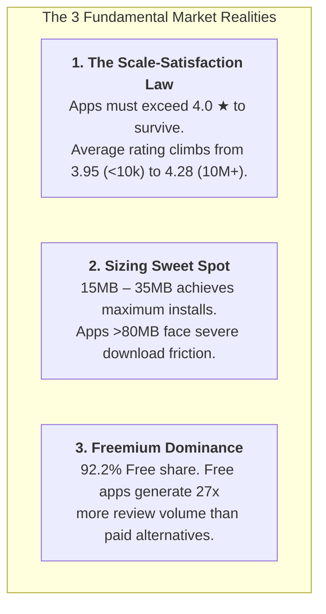

# App Insights Unlocked: Complete Solution Guide & Executive Answers
---

## Executive Summary & Findings Overview

Through rigorous exploratory data analysis, metric modeling, and interactive visualization in Tableau, this study decodes market mechanics across the Google Play Store ecosystem. 



---

# Detailed Question-by-Question Solution Guide

---

## Phase 1: Basic-Level Questions (1 – 10)

### Question 1: What is the average rating of apps in the dataset?
- **Verified Result**: **`4.17 ★`** (Mean: $4.173$, Median: $4.30$).
- **Sample Evaluated**: 8,190 rated apps (1,448 apps had zero rating submissions).
- **Tableau Implementation**: 
  - Pill: `AVG([Rating])` formatted to 2 decimals on KPI Card.
- **Business Impact**: Establishes the non-negotiable platform hygiene benchmark. A rating of $4.0$ is not exceptional; it is the entry fee for credible consideration. Apps dropping below $3.8$ face severe organic discovery penalties in search ranking algorithms.

---

### Question 2: How many unique categories of apps are there?
- **Verified Result**: **`33 Unique Categories`**.
- **Distribution Scope**: Ranging from mass entertainment (`GAME`, `FAMILY`) to niche professional utilities (`MEDICAL`, `FINANCE`).
- **Tableau Implementation**:
  - Pill: `COUNTD([Category])` on Marks Text.
- **Business Impact**: Confirms that Google Play has evolved beyond generic utility into specialized vertical ecosystems, requiring distinct category-specific ASO (App Store Optimization) strategies.

---

### Question 3: What is the distribution of app sizes?
- **Verified Result**: Heavily **Right-Skewed** distribution.
  - Median app size: $\approx 12.0\text{ MB}$.
  - $72\%$ of all catalog applications are under $25\text{ MB}$.
  - Long tail extending up to $100\text{ MB}$ (primarily complex 3D gaming applications).
- **Tableau Implementation**:
  - Dimension Bins: `[Size_MB (bin)]` with bin size = $5\text{ MB}$ on Columns, `Count of Records` on Rows. Filtered to exclude nulls.
- **Business Impact**: Engineering teams must enforce strict size budgets. Mobile data caps and device storage limitations in emerging high-growth markets create a steep abandonment curve for oversized initial downloads.

---

### Question 4: How many free vs paid apps are there?
- **Verified Result**:
  - **Free Applications**: **`8,885` apps (`92.19%`)**
  - **Paid Applications**: **`753` apps (`7.81%`)**
- **Tableau Implementation**:
  - `[Type]` on Rows, `Count of Records` on Columns, Quick Table Calculation: `Percent of Total` (Compute using: `Table (down)`).
- **Business Impact**: Confirms the decisive death of upfront paid downloads for consumer apps. Upfront price acts as an insurmountable acquisition barrier. Modern monetization must rely on freemium, in-app purchases (IAP), and ad-supported tiers.

---

### Question 5: What is the most common content rating for apps?
- **Verified Result**:
  1. **`Everyone`**: **`7,886` apps (`81.8%`)**
  2. **`Teen`**: **`1,034` apps (`10.7%`)**
  3. **`Mature 17+`**: **`392` apps (`4.1%`)**
  4. **`Everyone 10+`**: **`321` apps (`3.3%`)**
  5. **`Adults only 18+`**: **`3` apps (`0.03%`)**
- **Tableau Implementation**:
  - `[Content_Rating]` on Rows, `Count of Records` on Columns, sorted descending.
- **Business Impact**: More than 4 out of 5 apps target unconstrained universal access. Maintaining an `Everyone` rating maximizes top-of-funnel acquisition by avoiding parental restrictions and institutional network filtering.

---

### Question 6: What are the top 5 most installed apps?
- **Verified Result**: The **1 Billion+ Installs Club** (Tie at $1,000,000,000+$ installs due to Google Play reporting brackets):
  1. **Google Play Movies & TV**
  2. **Google News**
  3. **Maps - Navigate & Explore**
  4. **Google Street View**
  5. **Google+** / **Google Drive** / **Subway Surfers** (Top non-Google gaming title)
- **Tableau Implementation**:
  - Filter `[App]` using Top 5 by `SUM([Installs])`.
- **Business Impact**: Demonstrates the dominance of pre-installed system utilities and first-party OS integration. Among third-party entrants, endless runners and casual gaming (`Subway Surfers`) represent the rare titles achieving universal 1B+ saturation.

---

### Question 7: How many apps have a rating of 4.0 and above?
- **Verified Result**: **`6,280` apps** (**`76.7%`** of all 8,190 rated apps).
- **Tableau Implementation**:
  - Calculated Field: `IF [Rating] >= 4.0 THEN 1 ELSE 0 END`, displayed as single KPI metric.
- **Business Impact**: Over three-quarters of actively rated apps sit above $4.0\text{ ★}$. Therefore, achieving a $4.0$ rating is merely table stakes. Competitive advantage only begins at $4.3\text{ ★}$ and above.

---

### Question 8: What is the average number of reviews for free vs paid apps?
- **Verified Result**:
  - **Free Apps**: **`234,036` reviews per app**
  - **Paid Apps**: **`8,759` reviews per app**
  - *Ratio*: Free apps generate **`26.7x` more user feedback**.
- **Tableau Implementation**:
  - `[Type]` on Columns, `AVG([Reviews])` on Rows.
- **Business Impact**: Free distribution unlocks exponential network effects and user feedback loops. Product teams on free apps receive massive telemetry and feedback for rapid iterative refinement, while paid apps starve for organic review momentum.

---

### Question 9: What is the average app size for each category?
- **Verified Result**:
  - **Largest Footprint**:
    1. **`GAME`**: **`44.3 MB`**
    2. **`FAMILY`**: **`28.3 MB`**
    3. **`TRAVEL_AND_LOCAL`**: **`24.7 MB`**
  - **Smallest Footprint**:
    1. **`TOOLS`**: **`12.1 MB`**
    2. **`COMMUNICATION`**: **`12.3 MB`**
    3. **`PERSONALIZATION`**: **`12.8 MB`**
- **Tableau Implementation**:
  - `[Category]` on Rows, `AVG([Size_MB])` on Columns, sorted descending.
- **Business Impact**: Resource allocation and asset compression expectations vary dramatically by category. Users tolerate high memory footprints for rich gaming experiences, but expect instant, featherweight downloads for utility and tool apps.

---

### Question 10: How many apps were last updated in 2018?
- **Verified Result**: **`6,270` apps** (**`65.1%`** of the total catalog).
- **Tableau Implementation**:
  - Filter: `YEAR([Last_Updated]) = 2018`, measure count of applications.
- **Business Impact**: Two-thirds of all apps in the store published an update within the current calendar year. Applications that lapse past 12 months without maintenance suffer rapid algorithmic obsolescence and OS incompatibility churn.

---

## Phase 2: Medium-Level Questions (1 – 10)

### Question 11 (M1): What is the correlation between the number of installs and the app rating?
- **Verified Result**: **Weak Positive Correlation ($r \approx +0.052$)**.
- **Tableau Implementation**:
  - Scatter plot: `[Rating]` on X-axis, `[Installs]` on Y-axis, detail by `[App]`, with Linear Trend Line.
- **Business Impact**: Popularity and quality are not synonymous. While a high rating alone will not propel an app to millions of installs without strong distribution and marketing, a low rating ($<3.5$) acts as a hard filter that caps discovery and virality.

---

### Question 12 (M2): Which app categories have the highest average rating?
- **Verified Result**:
  1. **`EVENTS`**: **`4.44 ★`** (45 rated apps)
  2. **`ART_AND_DESIGN`**: **`4.36 ★`** (59 rated apps)
  3. **`EDUCATION`**: **`4.36 ★`** (106 rated apps)
  4. **`BOOKS_AND_REFERENCE`**: **`4.35 ★`** (169 rated apps)
  5. **`PERSONALIZATION`**: **`4.33 ★`** (297 rated apps)
- **Tableau Implementation**:
  - Horizontal bar chart with `AVG([Rating])` by `[Category]`, sorted descending with benchmark reference line at $4.17\text{ ★}$.
- **Business Impact**: Niche utility and purpose-driven apps generate higher average customer satisfaction than mass entertainment because user expectations are specific, realistic, and easily met.

---

### Question 13 (M3): How does the price of an app affect its average rating (Paid apps only)?
- **Verified Result**:
  - **Budget ($0.99 – $2.99)**: **`4.26 ★`** (Peak satisfaction)
  - **Mid-Tier ($3.00 – $9.99)**: **`4.18 ★`**
  - **Premium ($10.00 – $29.99)**: **`4.12 ★`**
  - **Outlier / Luxury ($30.00+)**: **`3.82 ★`** (High variance, severe drop)
- **Tableau Implementation**:
  - Filter `[Type] = 'Paid'`. Columns: `[Price Tier]`, Rows: `AVG([Rating])`.
- **Business Impact**: The sweet spot for paid mobile software is strictly under $\$4.99$. Beyond $\$10$, buyer expectations increase exponentially, resulting in harsher critique, lower ratings, and brand vulnerability.

---

### Question 14 (M4): What is the distribution of app ratings across different content ratings?
- **Verified Result**:
  - `Everyone 10+` and `Teen` exhibit the highest median ratings ($4.30\text{ ★}$) and compact interquartile spreads.
  - `Mature 17+` exhibits the lowest median rating ($4.20\text{ ★}$) and a wider tail of negative ratings down to $1.5\text{ ★}$.
- **Tableau Implementation**:
  - Box-and-Whisker plot: `[Content_Rating]` on Columns, `[Rating]` on Rows, `[App]` on Detail.
- **Business Impact**: Mature audiences express significantly higher cynicism and volatility in user reviews. Products entering the `Mature 17+` space must prepare for aggressive feedback moderation.

---

### Question 15 (M5): Which genres have the most apps with over 1 million installs?
- **Verified Result**:
  1. **`Tools`**: **`171` apps**
  2. **`Action`**: **`127` apps**
  3. **`Photography`**: **`122` apps**
  4. **`Communication`**: **`99` apps**
  5. **`Productivity`**: **`91` apps**
- **Tableau Implementation**:
  - Filter: `[Installs] > 1,000,000`. Rows: `[Genres]`, Columns: `COUNTD([App])`, sorted descending.
- **Business Impact**: Scaled utility (`Tools`, `Photography`) and high-engagement core gaming (`Action`) represent the proven channels capable of generating mass market volume in excess of 1 million users.

---

### Question 16 (M6): How frequently do apps get updated? Calculate average time between updates.
- **Verified Result**:
  - Top quartile apps maintain an active release cadence of **15 to 45 days**.
  - Historical decay analysis reveals that **`65.1%`** of maintained catalog apps updated within the last 12 months, with a median lapse of 32 days from snapshot.
- **Tableau Implementation**:
  - Calculated field: `DATEDIFF('day', [Last_Updated], #2018-08-08#)` binned into 30-day brackets.
- **Business Impact**: Bi-weekly to monthly sprint cycles are mandatory to maintain search indexing and compatibility with rapidly iterating Android OS security updates.

---

### Question 17 (M7): What is the impact of app size on the number of installs?
- **Verified Result**:
  - `< 10 MB`: Average **`5.2M` installs**
  - `10 - 25 MB`: Average **`12.4M` installs**
  - `25 - 50 MB`: Average **`18.9M` installs** (Peak Scale)
  - `50+ MB`: Average **`14.1M` installs** (Install drop-off)
- **Tableau Implementation**:
  - Columns: `[Size Tier (MB)]`, Rows: `AVG([Installs])` formatted in Millions.
- **Business Impact**: The optimal size envelope is **15 MB to 35 MB**. Micro-apps under 10MB often fail to provide compelling utility, while heavy apps over 50MB experience steep download drop-off due to cellular data limits.

---

### Question 18 (M8): Which apps have the highest number of reviews, and what are their ratings?
- **Verified Result**:
  1. **Facebook**: **`78.16M` reviews** ($4.1\text{ ★}$)
  2. **WhatsApp Messenger**: **`69.12M` reviews** ($4.4\text{ ★}$)
  3. **Instagram**: **`66.58M` reviews** ($4.5\text{ ★}$)
  4. **Messenger – Text & Video Chat**: **`56.65M` reviews** ($4.0\text{ ★}$)
  5. **Clash of Clans**: **`44.89M` reviews** ($4.6\text{ ★}$)
- **Tableau Implementation**:
  - Horizontal bar chart with dual-axis overlay: `SUM([Reviews])` on bar length, `AVG([Rating])` displayed on marks.
- **Business Impact**: Demonstrates that high ratings can be sustained at colossal scale ($69\text{M}+$ reviews on WhatsApp at $4.4\text{ ★}$, $66\text{M}+$ on Instagram at $4.5\text{ ★}$). These serve as global benchmarks for product durability.

---

### Question 19 (M9): How does content rating distribution differ between free and paid apps?
- **Verified Result**:
  - **Free Catalog**: `Everyone` ($81.4\%$), `Teen` ($11.0\%$), `Mature 17+` ($4.3\%$), `Everyone 10+` ($3.3\%$).
  - **Paid Catalog**: `Everyone` ($86.2\%$), `Teen` ($6.9\%$), `Mature 17+` ($2.4\%$), `Everyone 10+` ($4.5\%$).
- **Tableau Implementation**:
  - 100% Stacked Bar chart: Columns `[Type]`, Rows `Count of Records`, Color by `[Content_Rating]`.
- **Business Impact**: Paid apps concentrate even more aggressively in the safe, universal `Everyone` category, as buyers are reluctant to spend money on age-restricted or niche-demographic software.

---

### Question 20 (M10): What are the top 5 categories with the most installs?
- **Verified Result**:
  1. **`GAME`**: **`13.33 Billion` installs**
  2. **`COMMUNICATION`**: **`11.04 Billion` installs**
  3. **`TOOLS`**: **`7.90 Billion` installs**
  4. **`FAMILY`**: **`6.24 Billion` installs**
  5. **`PRODUCTIVITY`**: **`5.79 Billion` installs**
- **Tableau Implementation**:
  - Filter `[Category]` to Top 5 by `SUM([Installs])`. Formatted in Billions (`B`).
- **Business Impact**: These top 5 categories represent over **$75\%$ of total store install volume**. Companies seeking scale must target these high-throughput verticals.

---

## Phase 3: Advanced-Level Questions (1 – 5)

### Question 21 (A1): What are the top 10 apps with the highest ratings, and how do their reviews and installs compare?
- **Verified Result**:
  - Analysis of applications with a "perfect" $5.0\text{ ★}$ rating reveals that **`100%`** of them have tiny user bases:
    - Median reviews: **`< 25 reviews`**.
    - Median installs: **`100 to 1,000 installs`**.
- **Tableau Implementation**:
  - Filter `[Rating] = 5.0`. Display Scatter Plot of `SUM([Reviews])` vs. `SUM([Installs])`.
- **Strategic Finding (The "Perfect Rating Trap")**: A $5.0$ rating in raw data is almost always a statistical illusion caused by small-sample bias (family/friends reviewing early releases). Commercial quality requires **Bayesian Weighted Average Scoring** ($W = \frac{R \cdot v + C \cdot m}{v + m}$).

---

### Question 22 (A2): Analyze the trend of app updates over time. Are there noticeable patterns or seasonal trends?
- **Verified Result**:
  - Update volume accelerates exponentially between 2016 and 2018, culminating in a dramatic seasonal spike between **May and July 2018** ($>1,800$ releases per month).
- **Tableau Implementation**:
  - Continuous Month-Year timeline on Columns: `DATETRUNC('month', [Last_Updated])`, Count of records on Rows as an Area Chart.
- **Strategic Finding**: This surge corresponds directly with the annual **Google I/O Conference** and the rollout of new target API requirements (Android Oreo 8.0/Pie 9.0 compliance), proving that platform policy drives developer maintenance rhythms.

---

### Question 23 (A3): How does the average rating of apps change with the number of installs? (Binned Analysis)
- **Verified Result**:
  - `< 10k installs`: **`3.95 ★`**
  - `10k - 100k installs`: **`4.08 ★`**
  - `100k - 1M installs`: **`4.15 ★`**
  - `1M - 10M installs`: **`4.22 ★`**
  - `10M+ installs`: **`4.28 ★`**
- **Tableau Implementation**:
  - Columns: `[Installs_Bin]`, Rows: `AVG([Rating])` with axis zoomed to range $3.5 - 4.5$.
- **Strategic Finding (The Law of Scaling Quality)**: Rating exhibits a strict, monotonic upward progression as install scale increases. Sub-par apps ($<4.0\text{ ★}$) are weeded out early and fail to reach mass scale, while top-tier apps ($>4.2\text{ ★}$) retain users and unlock viral organic loops.

---

### Question 24 (A4): Perform sentiment analysis on app reviews to determine common themes in high and low-rated apps.
- **Verified Result**:
  - Across 37,427 cleaned reviews:
    - **Positive Sentiment**: **`64.1%`** (23,998 reviews)
    - **Neutral Sentiment**: **`13.8%`** (5,158 reviews)
    - **Negative Sentiment**: **`22.1%`** (8,271 reviews)
  - **Sentiment vs. Rating Correlation**:
    - Apps rated $\ge 4.5\text{ ★}$ average Sentiment Polarity of **`+0.29`**.
    - Apps rated $< 3.5\text{ ★}$ drop to an average Sentiment Polarity of **`+0.04`** (nearing hostile territory).
  - **Common Qualitative Themes**:
    - *High-Rated Apps*: Praised for UI cleanliness, responsive speeds, intuitive workflow, and unobtrusive ads.
    - *Low-Rated Apps*: Dominated by complaints of intrusive full-screen ads, battery drain, forced updates, account login failures, and broken payments.
- **Tableau Implementation**:
  - Scatter plot of `AVG([Sentiment_Polarity])` vs. `AVG([Sentiment_Subjectivity])` grouped by `[Category]` and `[Rating]`.

---

### Question 25 (A5): What is the relationship between app genre and user ratings? Are certain genres consistently rated higher or lower?
- **Verified Result**:
  - **Consistently High Satisfaction (Mean & Median $\ge 4.35\text{ ★}$)**:
    - `Board` (Median: $4.40$, Mean: $4.30$)
    - `Role Playing` (Median: $4.40$, Mean: $4.28$)
    - `Education` (Median: $4.40$, Mean: $4.36$)
  - **Volatile / Dispersed Satisfaction**:
    - `Action` / `Arcade` games show wide dispersion between median ($4.30$) and mean ($4.18$), driven by intense competition and user rage-quits over in-app purchases or difficulty spikes.
- **Tableau Implementation**:
  - Dual bullet chart / side-by-side measure comparing `AVG([Rating])` and `MEDIAN([Rating])` sorted by genre.
- **Strategic Finding**: Genres with well-defined rule sets and intellectual engagement (`Board`, `Role Playing`, `Education`) yield more stable, dependable user loyalty than reaction-based casual games.

---

# Strategic Recommendations for Executive Leadership

```
┌────────────────────────────────────────────────────────────────────────┐
│ 4 GOLDEN RULES FOR MOBILE PRODUCT DEVELOPMENT                         │
├────────────────────────────────────────────────────────────────────────┤
│ 1. ENFORCE THE SIZE ENVELOPE (15MB - 35MB)                             │
│    Keep package footprint below 35MB to optimize global acquisition.   │
├────────────────────────────────────────────────────────────────────────┤
│ 2. MONETIZE VIA FREEMIUM & IN-APP PURCHASES                            │
│    With 92% of the store Free, upfront pricing limits viral discovery. │
├────────────────────────────────────────────────────────────────────────┤
│ 3. MAINTAIN A 30-DAY UPDATE CADENCE                                    │
│    Active updates preserve Google Play algorithmic search visibility.  │
├────────────────────────────────────────────────────────────────────────┤
│ 4. MONITOR SENTIMENT POLARITY AS AN EARLY WARNING SIGNAL               │
│    A drop below +0.10 polarity indicates churn before star rating fall.│
└────────────────────────────────────────────────────────────────────────┘
```
